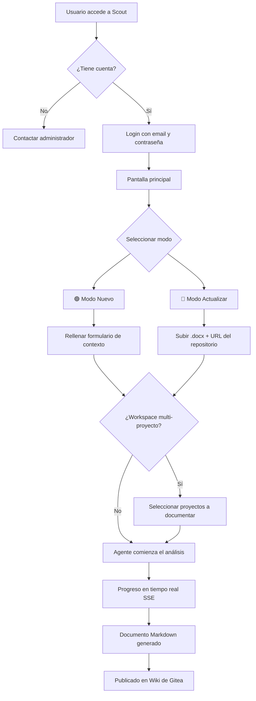
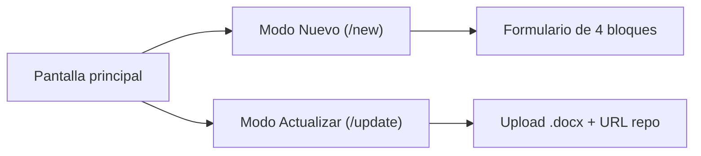
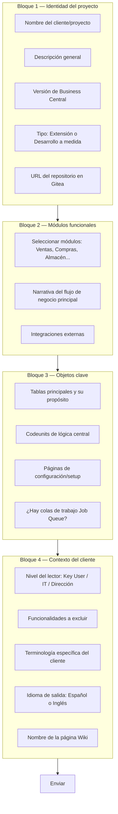
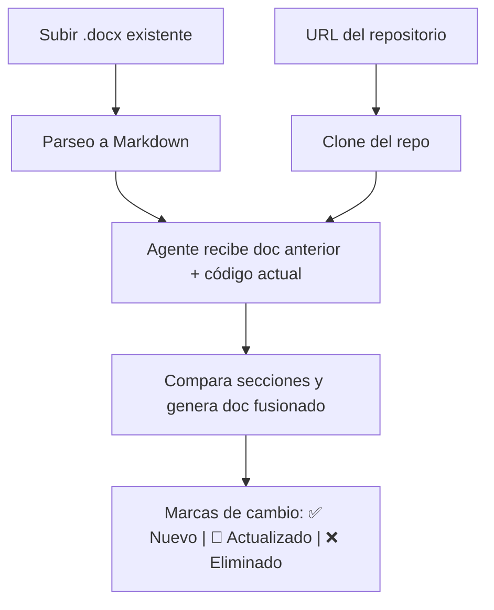
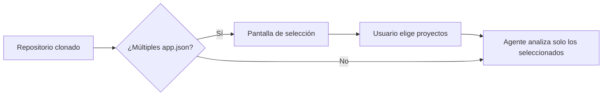
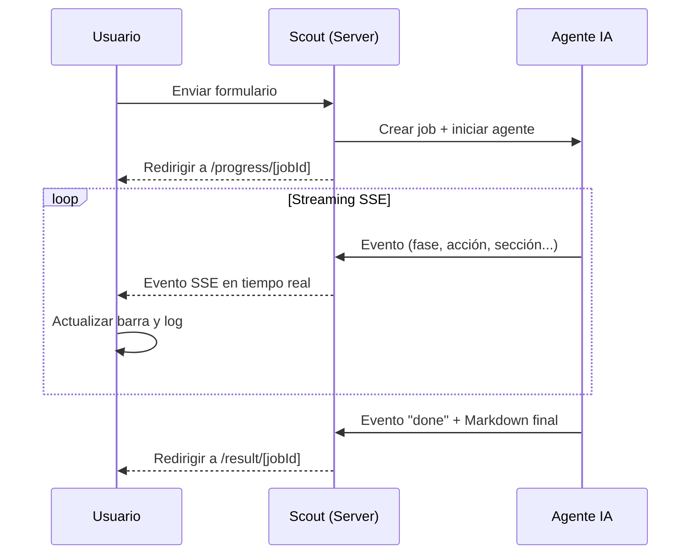
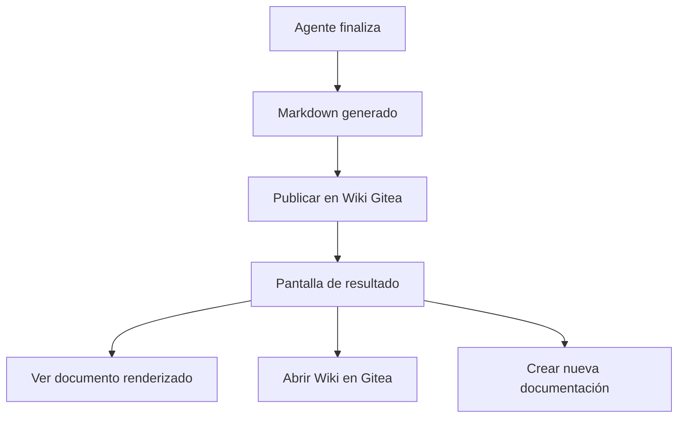
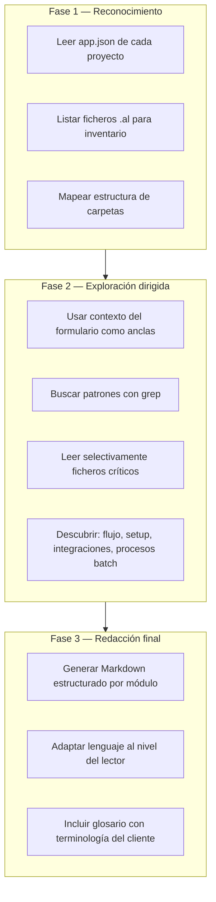
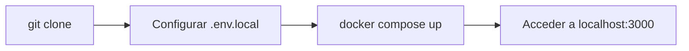

# Scout DEV

Herramienta web que analiza repositorios de **Business Central (AL)** alojados
en **Gitea** y genera documentación funcional orientada al cliente final,
publicándola automáticamente en la Wiki del mismo repositorio.

Un agente IA explora el código AL de forma incremental (lee manifiestos,
lista ficheros, busca patrones, abre solo lo relevante) y redacta un documento
Markdown estructurado siguiendo una metodología de consultoría funcional.

## Funcionalidades

- **Modo Nuevo** — Genera documentación desde cero a partir del código y un
  formulario de contexto (cliente, flujo de negocio, módulos, terminología).
- **Modo Actualizar** — Sube un `.docx` con documentación previa, el agente
  lo compara con el estado actual del código y produce una versión fusionada
  marcando cambios (nuevo, actualizado, eliminado).
- **Workspace multi-proyecto** — Detecta automáticamente repositorios con
  varios `app.json` y permite seleccionar qué proyectos documentar.
- **Publicación en Wiki** — El documento generado se publica directamente en
  la Wiki del repositorio Gitea.
- **Streaming en tiempo real** — El progreso del agente (ficheros leídos,
  búsquedas, fases) se muestra al usuario via SSE.
- **Autenticación** — NextAuth v5 con Credentials provider y JWT.
- **Bilingue** — Interfaz en Español e Inglés con persistencia en localStorage.
- **Tema claro/oscuro** — Toggle con persistencia.

## Stack

| Capa | Tecnología |
|------|-----------|
| Framework | Next.js 16 (App Router, `output: standalone`) |
| UI | React 19, Tailwind v4, Radix UI, lucide-react |
| Formularios | react-hook-form + zod |
| IA | Vercel AI SDK v6 + OpenRouter (`@openrouter/ai-sdk-provider`) |
| Parser Word | mammoth + turndown + turndown-plugin-gfm |
| Git | simple-git (clone con auth token) |
| Auth | NextAuth v5 (Credentials, JWT) |
| Markdown | react-markdown + remark-gfm |
| Deploy | Docker (multi-stage, Node 20 Alpine) |

## Comandos

```bash
npm install
npm run dev          # http://localhost:3000
npm run build        # build de produccion
npm run start        # servir el build
```

## Variables de entorno

Crea un fichero `.env.local` con las siguientes variables:

```env
# --- IA (obligatorio para agente real) ---
OPENROUTER_API_KEY=sk-or-...
MODEL=nvidia/nemotron-3-super-120b-a12b  # opcional, default: nvidia/nemotron-3-super-120b-a12b

# --- Gitea (obligatorio para clone + wiki) ---
GITEA_URL=https://git.example.com:3000
GITEA_TOKEN=tu-token-personal

# --- Auth ---
AUTH_SECRET=un-secreto-aleatorio-largo
AUTH_USERS=[{"email":"admin@example.com","password":"secret","name":"Admin"}]

# --- Opcionales ---
TEST_REPO_PATH=C:/repos/mi-proyecto-al  # dev: salta el clone, usa repo local
GIT_SSL_NO_VERIFY=true                  # para certificados autofirmados
TEMP_CLONE_DIR=/app/.tmp/repos          # directorio temporal de clones
```

Sin `OPENROUTER_API_KEY` la app funciona en modo demo con eventos simulados.

## Estructura del proyecto

```
app/
  page.tsx                          # Landing + selector de modo
  login/page.tsx                    # Login (NextAuth)
  new/page.tsx                      # Formulario Modo Nuevo
  update/page.tsx                   # Formulario Modo Actualizar
  select/[jobId]/page.tsx           # Selector de proyectos (workspace)
  progress/[jobId]/page.tsx         # Feed SSE de progreso en tiempo real
  result/[jobId]/page.tsx           # Vista del Markdown generado
  api/
    auth/[...nextauth]/route.ts     # NextAuth handler
    jobs/route.ts                   # POST crear job (+ upload .docx)
    jobs/[jobId]/route.ts           # GET metadata del job
    jobs/[jobId]/stream/route.ts    # GET SSE streaming del agente
    jobs/[jobId]/select/route.ts    # POST seleccion de proyectos

lib/
  ai/openrouter.ts                  # Cliente OpenRouter
  agent/
    run.ts                          # Orquestador del agente (streamText)
    tools.ts                        # Herramientas: list_files, read_file, grep, read_app_json
    prompts.ts                      # System + user prompts (Nuevo / Actualizar)
    workspace.ts                    # Descubrimiento de proyectos AL
    read-previous-doc.ts            # Herramienta de consulta del Word previo
  auth.ts                           # Config NextAuth v5
  gitea/
    clone.ts                        # Clone con simple-git + token auth
    api.ts                          # API REST Gitea v1 (metadata + wiki)
  parsers/word.ts                   # .docx a Markdown (mammoth + turndown)
  jobs/
    store.ts                        # Store de jobs en memoria
    types.ts                        # Tipos Job, JobEvent, JobMode, JobStatus
  i18n/                             # Provider + diccionarios ES / EN
  sse/                              # Encoder SSE + eventos mock (modo demo)

middleware.ts                       # Proteccion de rutas (NextAuth)
Dockerfile                          # Multi-stage build (Node 20 Alpine)
docker-compose.yml                  # Servicio + volumen para clones
```

## Deploy con Docker

```bash
docker compose up --build -d
```

El `Dockerfile` genera un build standalone optimizado. Incluye `git` en la
imagen para que `simple-git` pueda clonar repositorios. El volumen
`clone-tmp` persiste los repos temporales entre reinicios.

Para despliegues en plataformas como Dokploy, configura las variables de
entorno en el panel y apunta al repositorio. Si tu instancia Gitea usa
certificados autofirmados, anade `GIT_SSL_NO_VERIFY=true`.

---

## Guía de uso — Tutorial paso a paso

### Flujo general de la aplicación



---

### 1. Iniciar sesión

1. Abre la aplicación en tu navegador (por defecto `http://localhost:3000`).
2. Introduce tu **email** y **contraseña** configurados en la variable de entorno `AUTH_USERS`.
3. Pulsa **Iniciar sesión**. Si las credenciales son correctas, accederás a la pantalla principal.

> Las credenciales se definen en `.env.local` como un array JSON:
> ```env
> AUTH_USERS=[{"email":"usuario@empresa.com","password":"clave123","name":"Mi Nombre"}]
> ```

---

### 2. Pantalla principal — Seleccionar modo

Desde la pantalla principal puedes elegir entre dos modos de trabajo:

| Modo | Cuándo usarlo |
|------|--------------|
| **Nuevo** | No existe documentación previa. Quieres generar un documento funcional desde cero. |
| **Actualizar** | Ya tienes un `.docx` de documentación anterior y quieres que el agente lo actualice con los cambios del código. |



---

### 3. Modo Nuevo — Generar documentación desde cero

#### 3.1 Rellenar el formulario

El formulario tiene **4 bloques** que proporcionan al agente el contexto necesario para generar documentación de calidad:



**Campos importantes:**

- **URL del repositorio Gitea**: La URL completa del repositorio AL (ej: `https://git.empresa.com:3000/org/mi-proyecto`).
- **Nivel del lector**: Controla el tono del documento generado:
  - **Key User**: Lenguaje puramente funcional/negocio, sin tecnicismos.
  - **IT interno**: Puede mencionar tipos AL pero sigue siendo funcional.
  - **Dirección**: Resumen ejecutivo de alto nivel.
- **Nombre de la página Wiki**: Nombre con el que se publicará en la Wiki del repo (por defecto: `Documentacion-Funcional`).

#### 3.2 Enviar el formulario

Al pulsar **Enviar**, Scout:

1. Crea un **job** interno con los datos del formulario.
2. Clona el repositorio desde Gitea usando el token configurado.
3. Escanea si hay **múltiples `app.json`** (workspace multi-proyecto).
   - Si los hay, redirige a la pantalla de selección de proyectos.
   - Si no, inicia directamente el agente.

---

### 4. Modo Actualizar — Fusionar con documentación previa

1. Accede a **Modo Actualizar** (`/update`).
2. **Sube** el fichero `.docx` con la documentación existente (máx. 20 MB).
3. Introduce la **URL del repositorio Gitea**.
4. Pulsa **Enviar**.



El agente dispone de una herramienta especial (`read_previous_doc`) que le permite consultar secciones específicas del documento Word anterior y compararlas con el estado actual del código.

---

### 5. Selección de proyectos (Workspace multi-proyecto)

Si el repositorio contiene **varios ficheros `app.json`** (por ejemplo, una extensión base y módulos adicionales), Scout detecta automáticamente los proyectos y te permite elegir cuáles documentar.

1. En la pantalla de selección (`/select/[jobId]`), verás la lista de proyectos detectados.
2. Activa o desactiva cada proyecto con los checkboxes.
3. Pulsa **Continuar** para lanzar el agente con los proyectos seleccionados.



---

### 6. Progreso en tiempo real

Una vez iniciado el agente, se te redirige a la pantalla de progreso (`/progress/[jobId]`):

- **Barra de progreso** visual que avanza con cada fase del agente.
- **Log de acciones** en tiempo real mostrando:
  - Ficheros que el agente lee.
  - Búsquedas (`grep`) que realiza.
  - Fases del análisis (Reconocimiento → Exploración → Redacción).



> **No cierres la pestaña** mientras el agente trabaja. El progreso se muestra mediante Server-Sent Events (SSE).

---

### 7. Resultado y publicación en Wiki

Al finalizar, la pantalla de resultado (`/result/[jobId]`) muestra:

1. **El documento Markdown** generado, renderizado en pantalla.
2. Un **enlace directo a la página Wiki** del repositorio Gitea donde se publicó automáticamente.
3. Opciones para iniciar una nueva documentación.



**Estructura del documento generado:**

```
# [Nombre del Proyecto] — Documentación Funcional

## 1. Descripción general
## 2. Flujo principal de negocio
## 3. Módulos funcionales
   ### 3.1 [Área funcional 1]
   ### 3.2 [Área funcional 2]
   ...
## 4. Configuración y setup
## 5. Integraciones
## 6. Glosario
```

---

### 8. Metodología del agente IA

El agente sigue una metodología de **consultoría funcional en 3 fases**:



**Herramientas disponibles para el agente:**

| Herramienta | Descripción |
|-------------|-------------|
| `list_files` | Lista directorios (soporta filtro por extensión) |
| `read_file` | Lee contenido de ficheros (límite 40 KB por contexto) |
| `grep` | Busca patrones en el código (hasta 20 resultados) |
| `read_app_json` | Parsea manifiestos `app.json` |
| `read_previous_doc` | Consulta secciones del Word previo (solo Modo Actualizar) |

> El agente tiene un límite de **25 pasos** de herramientas para mantenerse dentro de los límites de contexto del LLM.

---

### 9. Modo demo (sin API key)

Si no configuras `OPENROUTER_API_KEY`, la aplicación funciona en **modo demo**:

- Todos los flujos funcionan normalmente (formularios, progreso, resultado).
- Los eventos de progreso son **simulados** — no se ejecuta ningún agente real.
- Útil para demostrar la interfaz o probar el frontend sin coste de API.

---

### 10. Despliegue rápido con Docker

```bash
# 1. Clona el repositorio
git clone <url-del-repo> scout-dev
cd scout-dev

# 2. Crea el fichero de entorno
cp .env.example .env.local   # o crea .env.local manualmente

# 3. Configura las variables obligatorias en .env.local
#    (ver sección "Variables de entorno" arriba)

# 4. Construye y ejecuta
docker compose up --build -d

# 5. Accede a http://localhost:3000
```



---

## Roadmap

- **Fase 1** ✅ Mockup visual navegable con SSE simulado
- **Fase 2** ✅ Agente real con Vercel AI SDK, clone, parser Word, wiki
- **Fase 3** ✅ Auth, Docker, deploy en Hostinger/Dokploy
- **Fase 4** 🔄 Historial de jobs persistente (Redis/DB), mejoras de UX
